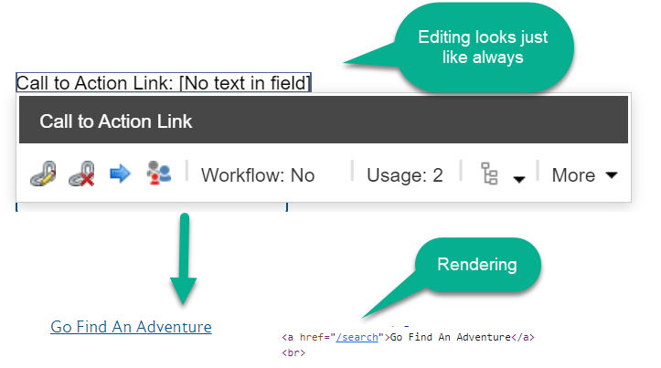
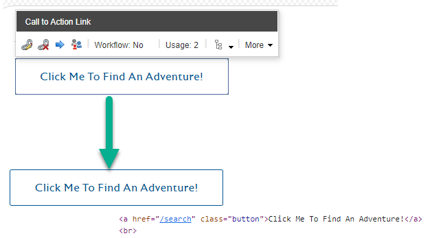
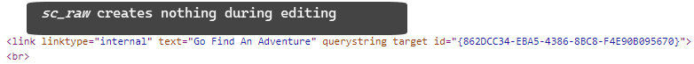
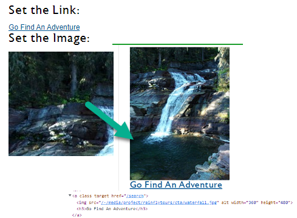

# TheCodeAttic.Sitecore.Scriban
Collection of projects as they relate to using Scriban templating with Sitecore

## TheCodeAttic.Sitecore.ScribanGeneralLinkExt

In the past few weeks, I have had almost the same conversations on how to manipulate the HTML around a General Link field within a Scriban template. Thus to save having to repeat myself and for future reference I figured it was time to write-something up. I have recently written a quick article that walks you through the few [steps to make a Scriban Extension](https://thecodeattic.wordpress.com/2022/03/24/creating-scriban-extensions-for-sitecore/), thus this article will focus on just the challenges of the General Link field.

What I have discovered is that the default rendering behavior within Scriban lacks the ability to easily access just the URL or even other properties such as target and description of the General Link field to create more complex displays. The most common approach to rendering out a General Link field is to simply call the *sc_field* Scriban extension to get both Experience Editor benifits as well as the rendered HTML when servering up content. In it's most basic form that looks like this:

```html
<!-- where 'Call to Action Link' is the name of the General Link Field -->
{{ sc_field i_item 'Call to Action Link'}}
```

The editing and rendering is fairly normal



You do have the ability to control basic HTML attributes, and even add custom attributes via the *sc_field* Scriban extension through an array of arrays. So to set a specific class on the rendred link as well as maybe change the text the scriban would be:

```html
<!-- where 'Call to Action Link' is the name of the General Link Field -->
{{ sc_field i_item 'Call to Action Link' [['class', 'button'], ['text', 'Click Me To Find An Adventure!']]}}
```

When editing and even rendering we can see how our attribution has taken effect. Thus with some really good CSS and maybe even a little JavaScript magic you could perform some interesting displays.



The issue this then drives us to is what if I want to allow an editor to select a link but this link should wrap say an image, or be used with some additional page content. The default *sc_field* extension only gets the rendered HTML a-tag which isn't fun to try and manipulate. The initial thing to try is to leverage the *sc_raw* extension, with the expectation that you'd have access to all the properties. Sadly, in my experience all you get is a rendered link-tag which is not very helpful.

```html
<!-- where 'Call to Action Link' is the name of the General Link Field -->
{{ sc_raw i_item 'Call to Action Link' }}
```



What does this lead us to then...creating our own custom Scriban extension. The following solution I have found to be most successful with the least amount of code is not purely mine, as I am sure I pieced this togother from other articles and converasations, which I no longer have noted. For a full understanding of how to create a Scriban extension check-out last week's article [Creating Scriban Extensions for #Sitecore](https://thecodeattic.wordpress.com/2022/03/24/creating-scriban-extensions-for-sitecore/),

The code is fairly straightforward in that you implement *IGenerateScribanContextProcessor*, setting the import to be **sc_general_link**. The delegate method logic will retrieve the named field, and parse into its unique attributes for our usage within the Scriban.

```csharp
//1. Inherit from IGenerateScribanContextProcessor
public class ScribanGeneralLink : IGenerateScribanContextProcessor
{
    // 2. Implement the Process method as defined by the IGenerateScribanContextProcessor interface
    public void Process(GenerateScribanContextPipelineArgs args)
    {
        // 2a. Import the fucntion name and its asscoiated logic
        args.GlobalScriptObject.Import(
            "sc_general_link", // name of the function that will be used within Scriban, to trigger the logic
                new DoGeneralLink(GeneralLink)); // parameter two is a Delegate tied to the custom logic, method parameters are populated in order from the declaration within Scriban
    }

    // 3. Delegate declaration
    private delegate GeneralLinkDetails DoGeneralLink(Item item, string linkFieldName);

    // 4. Method which contains the actual logic that is to be performed, and called by the delegate
    /// <summary>
    /// Retrieves the named field from the item.
    /// IF the field is a LinkField THEN it is parsed into its parts for easy usage
    /// </summary>
    /// <param name="item">Sitecore Item</param>
    /// <param name="linkFieldName">Name of the Field to be Retrieved</param>
    /// <returns>NULL - if item or field do not exist. GeneralLinkDetails object, that contains the parsed link attributes</returns>
    public GeneralLinkDetails GeneralLink(Item item, string linkFieldName)
    {
        if (item == null)
            return null;

        if (item.Fields[linkFieldName] == null)
            return null;

        LinkField lnkField = (LinkField)item.Fields[linkFieldName];
        if (lnkField == null)
            return null;

        // 4a. Parse the LinkField into a GeneralLinksDetails model class,
        // this provides the unique attributes for usage within Scriban
        return new GeneralLinkDetails(lnkField);
    }
}
```

In addition, to the CSharp logic, we need a patch-config file to register our extension. This should be deployed to *App_Config/Include/Foundation/* or other appropriate config file location for your setup. The file itself is small and straightforward

```xml
<configuration xmlns:patch="http://www.sitecore.net/xmlconfig/">
	<sitecore>
		<pipelines>
			<generateScribanContext>
				<processor type="TheCodeAttic.Sitecore.ScribanGeneralLinkExt.ScribanGeneralLink, TheCodeAttic.Sitecore.GeneralLinkExt" resolve="true" />
			</generateScribanContext>
		</pipelines>		
	</sitecore>
</configuration>
```

The only downside to this extension is that when in Experience Editor you must compensate for the inability to directly edit the field, thus usage will involve a check against *o_pagemode.is_experience_editor_editing*.

```html
<!-- Need to provide a way to allow for the setting of the link and image -->
{{ if ( o_pagemode.is_experience_editor_editing ) }}
    <h5>Set the Link:</h5>    {{ sc_field i_item 'Call to Action Link'}}
    <br/>
    <h5>Set the Image:</h5>     {{ sc_field i_item 'Call to Action Image' }}
{{ else }}
    <!-- Retreive our link model through the custom extension -->
    {{ $linkUrl  = sc_general_link i_item 'Call to Action Link' }}

    <!-- Using the variable access syntax of $ + varname can access the different properties -->
    <a class="{{$linkUrl.linkcssclass}}" target="{{$linkUrl.linktarget}}" href="{{ $linkUrl.linkurl }}">
        {{ sc_field i_item 'Call to Action Image' }}
        <h3>{{ $linkUrl.linkdescription }}</h3>
    </a>
{{ end }}
```



The above code can easily be grabbed out of [GitHub in the repository https://github.com/gillissm/TheCodeAttic.Sitecore.Scriban](https://github.com/gillissm/TheCodeAttic.Sitecore.Scriban).

## References

* [https://doc.sitecore.com/xp/en/developers/sxa/102/sitecore-experience-accelerator/the-embedded-functions-for-the-scriban-template.html](https://doc.sitecore.com/xp/en/developers/sxa/102/sitecore-experience-accelerator/the-embedded-functions-for-the-scriban-template.html)
* [https://github.com/gillissm/TheCodeAttic.Sitecore.Scriban](https://github.com/gillissm/TheCodeAttic.Sitecore.Scriban)
